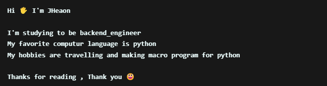

Today : 

## 
 😀 Introduce 
 

<figure class="half">
    
    
<figure>

### 
 ● Lang & Backend & Cowork 

 

  

 

## 
 ✌️ Contact Me 

  
Naver Blog : [Blog](https://blog.naver.com/j3heawon) 
Naver Knowledge : [Naver_Knowledge](https://kin.naver.com/profile/index.naver?u=eYO%2FFY%2B2WC5abpKVQY%2BMF0WM245Z4tWlMrTkfvBwvU0%3D) 
BOJ, Solved.ac: [KR_Heaon](https://www.acmicpc.net/user/kR_heaon)  
BOJ_solution_code : [BOJ](https://github.com/JHeaon/Beakjoon) 
Projects : [Heaon_Project](https://github.com/JHeaon/Heaon_project)
  
 

## 
 🪧 Certification 

