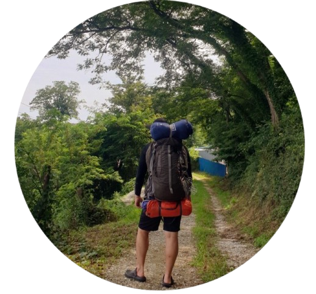

  

  
  
  

  ### 정해원(JHeaon)

   
  ---
    

 

 안녕하세요🙋🏻 배움을 갈망하는 개발자 정해원 입니다.  빠르게 기획하고 만들어 가치를 평가받는 것에 많은 관심을 가지고 있습니다. 

  

활동내역

- 🦠멋ìŸì´ 사ì처럼 10기 수료 ë° 11기 멘토 í™œë™ (2022.04 ~ 23.08)
- ✏️ 네이버 엑스퍼트 Python 개발자 í™œë™ (2022.6 ~ 23.08)
- 🢠í¬ëª½ Python í”„ë¡œê·¸ë¨ ê°œë°œ 외주 í™œë™ (2022.10 ~ 23.09)

대표 프로젝트

- [Campus Note](https://github.com/JHeaon/Project_CompusNote) - 대구, 경북권 해커톤 
- [Capston Design](https://github.com/JHeaon/Project_CapstonDesign) - 계명대학교 캡스톤디자인
- [Ddonggangaji](https://github.com/ddonggangaji/backend) - 멋쟁이사자처럼 11기 해커톤

 

기술스택

깃허브 활동

